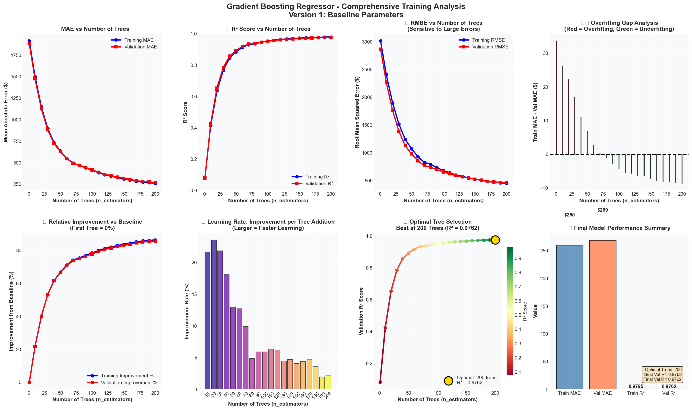
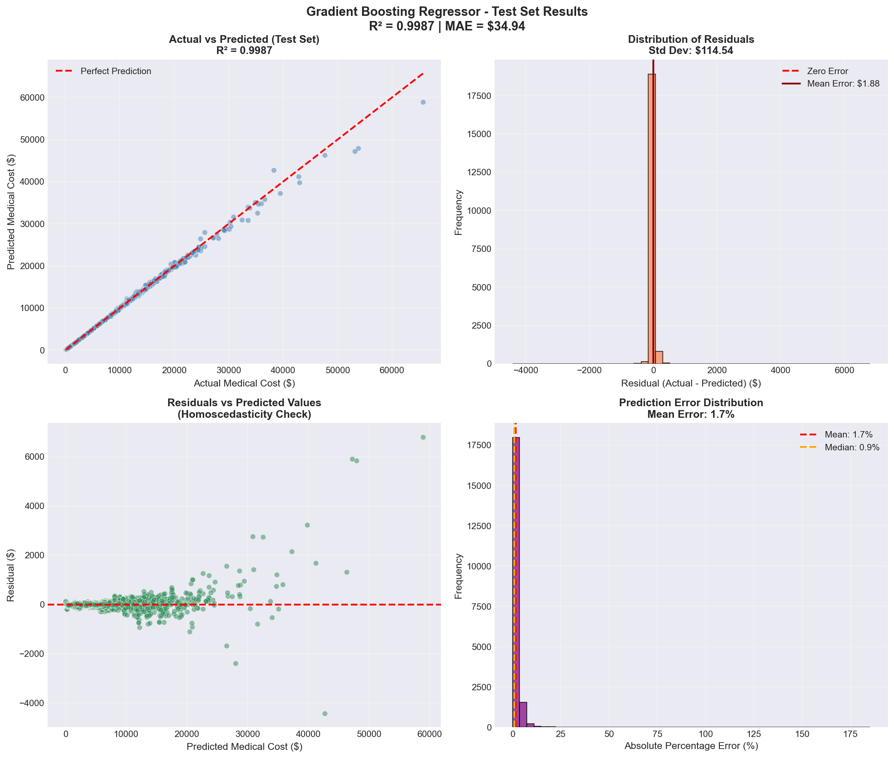

# Gradient Boosting Regressor👾

## Overview
Gradient Boosting is an ensemble machine learning technique that builds multiple decision trees sequentially, where each new tree tries to correct the errors made by the previous trees.

## Why Gradient Boosting for Medical Costs?
♦️ Handles non-linear relationships (e.g., age vs cost spikes at certain ages)

♠️ Works with mixed data types (numerical + categorical)

♥️ Robust to outliers (medical cost outliers common)

♣️ Provides feature importance (tells you what drives costs)

## Methodology
1. Imported all necessary libraries
2. Scikit-learn is used for hyperparameter tuning
3. Loaded Dataset
4. Feature selection and defined columns to consider
5. Created virtual environment -> python -m venv venv
6. Installed libraries -> pip install pandas numpy scikit-learn matplotlib seaborn joblib
7. Configured feature selection, preprocessing and data splitting
8. Training model configuration with initial hyperparamters
9. Trained the model
10. Used validation set during the incremental training to monitor performance and find the best hyperparameters
11. Hyperparameter tuning
12. Repeated till a good model arrives
13. Saved the model
14. Saved model tested on testing set
15. Added test results and analysis
16. Added a feature predictiveness analysis after hyperparameter tuning

## 🃏Hyperparameters used:
- n_estimators: 200
- learning_rate: 0.05
- max_depth: 4
- min_samples_split: 10
- subsample: 0.8
- min_sample_leaf: 5
- max_features: sqrt
- random_state: 42

## 🏁Test Results and analysis: 
#### Training Results against validation set

#### Test Results

### 🎲Try yourself
##### Run python gradient_boosting_regressor_model.py or 
##### Run .ipnyb file from kernel on VS code or on google colabs

